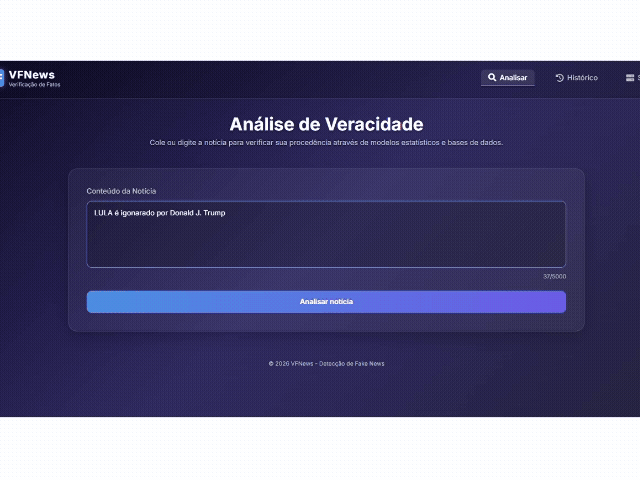

<div align="center">


# 📰 VFNews — Detecção de Fake News com IA

**Verificação automática de notícias combinando a API de Fact-Check do Google com um modelo próprio de Machine Learning treinado em português.**


[Demonstração](#-demonstração) • [Funcionalidades](#-funcionalidades) • [Como executar](#-instalação) • [Roadmap](#-roadmap)

</div>

---

## 💡 Sobre o projeto

Fake news não se resolve só com "achismo" — precisa de dados. O **VFNews** nasceu como um estudo prático de como combinar **fontes oficiais de checagem** com **um modelo de Machine Learning próprio**, para responder uma pergunta simples: *essa notícia é verdadeira ou falsa?*

O fluxo de decisão é o seguinte:

1. O usuário cola um texto (manchete, trecho de notícia, alegação).
2. O sistema primeiro consulta a **Google Fact Check Tools API** — se já existe uma checagem oficial publicada por um veículo de fact-checking sobre aquele conteúdo, o resultado é confiável de imediato.
3. Se o Google não encontrar nada, entra em ação um **modelo de Regressão Logística treinado com TF-IDF** sobre uma base de mais de 1.000 manchetes reais, balanceada entre verdadeiro e falso (fontes como Agência Brasil, TSE, Aos Fatos, Lupa e o corpus acadêmico Fake.br-Corpus), que estima a probabilidade do texto ser verdadeiro ou falso.
4. Toda consulta é registrada — em PostgreSQL quando disponível, com fallback automático para CSV — e realimenta a base de dados, fechando o ciclo de aprendizado contínuo.

> Projeto desenvolvido com foco em fins acadêmicos e de portfólio, mas construído com práticas de um sistema real: persistência em banco, fallback resiliente, coleta de dados automatizada e retraining agendado.

## 🎥 Demonstração




## ✨ Funcionalidades

- 🔎 **Análise de veracidade em tempo real**, combinando API externa + modelo local
- 🧠 **Modelo de ML próprio** (TF-IDF + Regressão Logística) treinado sobre dataset em português
- 🌐 **Integração com Google Fact Check Tools API** para checagens oficiais já publicadas
- 📡 **Coleta automatizada de dados** via NewsAPI, GNews e FactCheckExplorer
- ⏱️ **Retreinamento agendado** do modelo a cada 24h (via `schedule`), com métricas de accuracy, precision, recall e F1-score registradas a cada execução
- 🗄️ **Persistência híbrida**: PostgreSQL como fonte principal, com fallback automático para CSV caso o banco esteja indisponível
- 📊 **Painel de status** mostrando em tempo real quais integrações estão ativas (Google API, NewsAPI, modelo de ML, banco de dados)
- 📜 **Histórico de consultas** com data, fonte, resultado e nível de confiança
- 🎨 **Interface web responsiva**, em HTML/CSS/JS puro, sem dependências de frontend pesadas

## 🛠️ Tecnologias

| Camada | Tecnologias |
|---|---|
| Backend | Python 3.12, Flask |
| Machine Learning | scikit-learn (TF-IDF, Logistic Regression), pandas, joblib |
| Coleta de dados | NewsAPI, GNews API, FactCheckExplorer, BeautifulSoup, langdetect |
| Persistência | PostgreSQL (psycopg2), CSV (fallback) |
| Agendamento | `schedule` (jobs diários de coleta + retreinamento) |
| Frontend | HTML5, CSS3, JavaScript (vanilla) |

## 📁 Estrutura do projeto

```text
vfnews/
├── app.py                          # Aplicação Flask: rotas e orquestração
├── database/
│   └── db_connection.py            # Camada de acesso ao PostgreSQL (com fallback)
├── services/
│   ├── fact_check_service.py       # Integração com a Google Fact Check API
│   ├── predict.py                  # Carrega o modelo treinado e classifica o texto
│   ├── dataset_service.py          # Histórico de consultas + estatísticas do dataset
│   ├── data_collection_service.py  # Coleta de notícias (NewsAPI, GNews, FactCheck)
│   └── training_service.py         # Pipeline de treinamento (TF-IDF + Reg. Logística)
├── scheduler/
│   └── scheduler_tasks.py          # Agenda coleta (02:00) e retreinamento (03:00) diários
├── templates/
│   └── index.html                  # Interface web (SPA simples por seções)
├── static/
│   ├── css/style.css
│   ├── js/script.js
│   └── img/
├── dataset_consolidado.csv         # Base de treino (texto, label, fonte, data)
├── model.pkl / vectorizer.pkl      # Modelo e vetorizador TF-IDF treinados
├── .env.example                    # Modelo de variáveis de ambiente (sem chaves reais)
└── requirements.txt
```

## 🚀 Instalação

### Pré-requisitos
- Python 3.12+
- (Opcional) PostgreSQL — sem ele, a aplicação roda normalmente em modo fallback com CSV

### Passo a passo

```bash
# 1. Clone o repositório
git clone https://github.com/seu-usuario/vfnews.git
cd vfnews

# 2. Crie e ative o ambiente virtual
python -m venv .venv
.venv\Scripts\activate        # Windows
source .venv/bin/activate     # Linux/macOS

# 3. Instale as dependências
pip install -r requirements.txt

# 4. Configure as variáveis de ambiente
cp .env.example .env
# Edite o .env e preencha GOOGLE_API_KEY, NEWS_API_KEY, GNEWS_API_KEY e DATABASE_URL

# 5. Execute a aplicação
python app.py
```

A aplicação estará disponível em `http://localhost:5050`.

> Sem chaves de API configuradas, a aplicação ainda funciona — o sistema usa apenas o modelo de Machine Learning local para classificar os textos.

## 📖 Como usar

1. Acesse a aba **Analisar**.
2. Cole o texto da notícia que deseja verificar (até 5000 caracteres).
3. Clique em **Analisar notícia**.
4. O resultado mostra o veredito (Verdadeiro / Falso / Indeterminado), o percentual de confiança e a fonte usada na análise (Google Fact Check API ou modelo local).
5. Na aba **Histórico**, veja as últimas 15 consultas realizadas.
6. Na aba **Status**, acompanhe em tempo real quais serviços estão ativos e as métricas do último retreinamento do modelo.

## 🗺️ Roadmap

- [ ] Suporte multilíngue (inglês e espanhol)
- [ ] Dashboard analítico com gráficos de tendência de desinformação por tema
- [ ] Endpoint de API pública documentado (Swagger/OpenAPI)
- [ ] Testes automatizados (pytest) para services e rotas
- [ ] Pipeline de CI/CD com GitHub Actions
- [ ] Deploy público (Render/Railway) com link de demo ao vivo
- [ ] Explicabilidade do modelo (quais palavras mais influenciaram o veredito)

## 🧩 Desafios técnicos

- **Fallback resiliente**: o sistema precisava continuar funcionando mesmo sem PostgreSQL configurado — cada operação de escrita/leitura tenta o banco primeiro e cai automaticamente para CSV em caso de falha, sem que o usuário perceba diferença na experiência.
- **Qualidade do dataset em português**: dados vindos de APIs internacionais (GNews, NewsAPI) frequentemente retornam textos em outros idiomas. Foi necessário aplicar `langdetect` como filtro rigoroso antes de qualquer registro entrar no dataset de treino.
- **Aprendizado contínuo controlado**: para evitar que o modelo "aprendesse" com previsões de baixa confiança, apenas classificações acima de 92% de certeza são automaticamente realimentadas no dataset.
- **Duas fontes de verdade**: equilibrar a velocidade/confiabilidade da API do Google com a autonomia do modelo local, decidindo quando confiar em cada uma.

## 📚 Aprendizados

- Como estruturar um pipeline de ML simples (coleta → limpeza → vetorização → treino → avaliação → deploy) de forma que ele possa ser **re-executado automaticamente** sem intervenção manual.
- Diferença prática entre depender 100% de uma API externa versus ter um modelo próprio como rede de segurança.
- Como projetar uma camada de persistência que **degrada graciosamente** (PostgreSQL → CSV) em vez de quebrar a aplicação.
- A importância de logging estruturado para depurar jobs que rodam sem supervisão (scheduler).

## 📸 Capturas de tela


## 👤 Autor

**Gustavo Moreira**

Desenvolvedor focado em Python, Machine Learning aplicado e backend com Flask. Este projeto representa um estudo prático de como unir NLP, integração de APIs externas e persistência resiliente em uma aplicação real, de ponta a ponta.

[](https://www.linkedin.com/in/gustavo-moreira-deev)
[](https://github.com/Nocthorne)
[](mailto:gustavomoreirast@gmail.com)
[](mailto:gustavomoreira.deev@gmail.com)

## 📄 Licença

Este projeto está licenciado sob a licença MIT — veja o arquivo [LICENSE](LICENSE) para mais detalhes.
